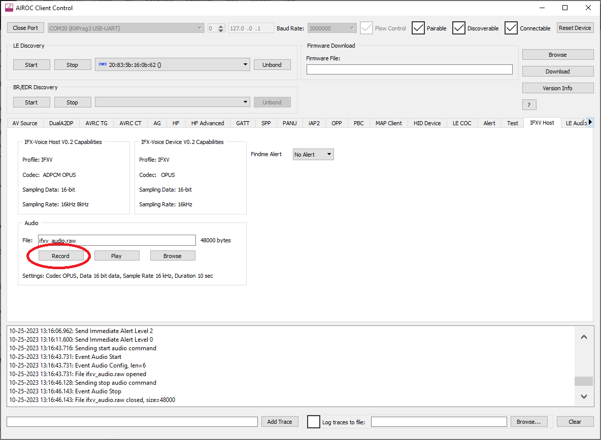

# IFX-Voice LE Remote Control Sample Application

## Overview

The IFX-Voice LE Remote Control sample application demonstrates audio capabilities using Infineon Voice over GATT Profile (VoGP) protocol. This application is used together with the IFX-Voice Host application. The Client Control host application is used to navigate the demonstration and audio playback.

See the [docs/IFXVoiceOverGattProfile.pdf](docs/IFXVoiceOverGattProfile.pdf) file for details on the IFX VoGP implementation.

## WARNING: Sample 16-bit service UUID not for production use
This application demonstrates the use of a custom GATT service using 16-bit service UUID 0x0000. This is not a valid service UUID and **MUST NOT BE USED IN A SHIPPING PRODUCT**. To use this code in a shipping product, users must purchase a valid 16-bit service UUID from the Bluetooth&#174; SIG, see https://support.bluetooth.com/hc/en-us/articles/360062030092-Requesting-Assigned-Numbers

When a valid 16-bit service UUID is obtained, the source code in this Remote application must be modified to use it, change:

`source/audio/protocol/COMPONENT_ifxv/design.cybt: <Property id="UUID" value="0000"/>`

The IFX-Voice LE Host sample used in conjunction with this sample must also be modified to match the valid service UUID.

## Codec Supported

- ADPCM
- OPUS

## Features demonstrated

- Initiate live audio transmission from the IFX-Voice Remote (ifxv-remote) to the IFX-Voice host (ifxv-host).
- Process command from ifxv-host to start audio.
- Record MIC input and save to PCM raw data file.
- Send a voice data file from ifxv-remote to ifxv-host.
- Over the air firmware upgrade capability
- IR capability
- Immediate Alert (Findme) capability

## Supported BSP

- CYW920835REF-RCU-01
- CYW920835M2EVB-01
- CYBLE-343072-EVAL-M2B
- CYBLE-333074-EVAL-M2B

## Build, Program, and Launch Client Control

1. Plug CYW920835REF-RCU-01, CYW920835M2EVB-01, CYBLE-343072-EVAL-M2B, or CYBLE-333074-EVAL-M2B kit into your computer.

2. Build the firmware based on the BSP and download the application to the kit. If the device cannot be detected, it is possible the HCI-UART is opened by other applications such as Client Control. Make sure the port is closed and ready from firmware downloading. If the device still cannot be detected after closing the HCI-UART port, it could mean the firmware is corrupted and the device is not functional. In this case, the device needs to be factory reset with the recovery procedure. To perform recovery in CYW920835M2EVB-01, press and hold the recovery button (red), press the reset button (blue), and then release the recovery button.

   

   For CYW920835REF-RCU-01, place a push button between GND and SPI\_MOSI pin at the PUART connector. To recover the device, unplug the device first. While pressing the button (shorting GND and SPI\_MOSI pin), power up the device by plugging it in (step 1). Then, the device should be in programming mode and ready for step 2.

   

3. Launch the Client Control application, choose 3000000 as the baud rate and select the serial port in Client Control tool window. The serial port should be the same port that was used to program the board.

4. Press the reset button once after the port is opened to establish communication with Client Control. If SDS, Shut Down Sleep (SLEEP_ALLOW = 2), is configured in the build, a core-dump followed by a reset will show in log if the device has already entered SDS. After the communication is established, the 'HID Device' tab should be activated and the controls in the 'Audio' group should show the device capability. The capabilities can be changed in the application makefile when building the firmware. See Application Settings section below.

   

5. Optionally, the PUART can be opened for console display. (115200, 8, N, 1, No Flow control)

   

   Follow the same steps for ifxv-host application. (See README.md in ifxv-host)

## LED Indicator

- Red LED:
    * 	Off: Audio is not active
    * 	Solid on: Audio is active

- Yellow/Green LED:
    * 	Slow blink (1 Hz), advertising for pairing.
    * 	Fast blink (4 Hz), reconnecting.
    * 	Solid on: Link is up, ready for audio testing

## Initiate Connection

Press reset at ifxv-remote. The device should start advertising for discovery. If the ifxv-remote device is already paired previously, to erase the previous pairing, press and hold the user button (black button) and then reset. Hold the user button until the yellow starts to do a slow (1 Hz) blink.

Press reset at ifxv-host. The host will start to scan for ifxv-remote with slow blink at 1 Hz. Once the device is found, it initiates the connection.

After the LE connection is made, the host will enter service discovery with a fast blink in 4 Hz frequency.

After service discovery completes, both host and remote's LED turns solid on to indicate the link is ready for audio testing.

## Audio testing

In CYW920835M2EVB-01, the digital MIC pins are shared with LEDs. When testing with DMIC, the slide switch SW4 must be shift to DMIC position. The LEDs are disabled when testing with DMIC.
The CYW920835REF-RCU-01 does not have DMIC mounted. It is not capable for DMIC testing.

1. Initiate live audio streaming from ifxv-remote to ifxv-host.

   This is the most common usage that the user presses the audio button at the remote to start to voice audio streaming. The Client Control's 'Audio' button is the soft button, acting the same as the physical audio button in the remote if available. In CYW920835M2EVB-01, the user button is used for the audio button when the link is up. Press and hold the Audio button should start MIC voice audio streaming to the host. The Red LEDs should be turned solid on and the host Client Control file size starts to increment for the audio data received. After releasing the button, the audio streaming stops. The host Client Control saves the audio to the specified file and then playback the file just saved. Because of the LE bandwidth, without compression, this live audio streaming operation is not available if no CODEC is used.

   

2. Record voice audio.

   This function is for debugging to ensure the MIC input is functional. Once it is started, it takes input from MIC and saves the PCM raw data into a file without sending it to the air. After recording, the audio is played back automatically. Optionally, the audio can be saved in encoded format. In this case, since Client Control cannot play back encoded data, the file will not be played back. Since the operation has nothing to do with Bluetooth&#174;, this operation can be done without an LE link.

   

3. Send a voice audio file.

   This function is also for debugging to ensure the encoding is functional. Instead of getting audio input from the MIC, it takes input from a file and sends it to the host for playback. The file saved with the 'Record' function can be used as an input file. If the input file is PCM raw data, 'Encoded' checkbox is not checked, the data is encoded before being sent to the host. The host then decodes the data for playback. Since the data is sent over LE, the link must be up and ready.

   

4. Initiate live audio streaming from ifxv-host.

   Similar to test 1, the live audio streaming can be initiated from the host. Click on the 'Record' button at ifxv-host Client Contol to start audio recording. Releasing the button will stop recording.

   

5. Erasing pairing information.

   In any case, if the pairing data needs to be erased, use 'Virtual Unplug' button in Client Control to remove the pairing. When Client Control is not avaiable, the erasing pairing can by done by the buttons with the following sequence: While press and hold user (black) button, press reset (blue) button to reset the device. Continue to hold black button until the LED starts to do slow blink. The pairing data is erased and ready to be paired with a new host.

## IR Testing

If the physical IR button is not available, use Client Control 'IR' virtual button to send IR signal. For the BSPs that use CYW9BTM2BASE1 baseboard, such as CYW920835M2EVB-01, CYBLE-343072-EVAL-M2B or CYBLE-333074-EVAL-M2B, the IR signal can be probed on P38 which is mapped to J3 pin 2 (SDA).
Do not enable IR for CYW920835REF-RCU-01 because P38 conflicts with battery monitoring on that BSP. Code would need to be changed to use another GPIO for IR on that BSP before enabling it.

## Findme Testing

Use the pull-down menu in Client Control to select and send alert level. The red LED should react to the alert level.

## OTA Firmware Upgrade

This application supports OTA Firmware Upgrade. To update the application, see the readme in wiced\_btsdk\tools\btsdk-peer-apps-ota.

## SDS (Shut Down Sleep)

When the sleep mode is set to SLEEP_ALLOWED=2, SDS is enabled. When in SDS, the device is powered down. Any event, such as GPIO event or Bluetooth link events can wake up the device to resume the activity. The power consumption current can be measured with VBAT power source, J8, between pin 2 and 3 in the baseboard. The testing showing abut 1 uA when the device is in SDS with CYW920835M2EVB-01 radio module. The reading was higher with CYBLE-343072-EVAL-M2B radio module.

# Application Settings
See the application makefile for details about these make variables.

- CUSTOM / TARGET
    - Use those settings to build the intended target hardware platform.

    ~~~
    CUSTOM=1    Use custom bsp with 3x5 key matrix
    CUSTOM=2    Use custom bsp with 3x6 key matrix
    CUSTOM=0    The bsp will be specified by TARGET (Default)

                Supported TARGET
                    CYW920835M2EVB-01
                    CYW920835REF-RCU-01 (Default)
                    CYBLE-343072-EVAL-M2B
                    CYBLE-333074-EVAL-M2B
    ~~~

- TESTING\_USING\_HCI
    - Since the application uses Client Control, this flag should be set at all times.

- SLEEP\_ALLOWED=n

   ~~~
   SLEEP_ALLOWED=0  Disable sleep function
   SLEEP_ALLOWED=1  Allow sleep without shutdown
   SLEEP_ALLOWED=2  Allow sleep with shutdown (Default)
   ~~~

- OTA\_FW\_UPGRADE=n

   ~~~
   OTA_FW_UPGRADE=0  Disable OTA firmware upgrade feature
   OTA_FW_UPGRADE=1  Build with OTA firmware upgrade feature (Default)
   ~~~

- OTA\_SEC\_FW\_UPGRADE=n

   ~~~
   OTA_SEC_FW_UPGRADE=0  Disable secure OTA firmware upgrade feature (Default)
   OTA_SEC_FW_UPGRADE=1  Use this option for secure OTA firmware upgrade, this flag is valid only when OTA_FW_UPGRADE is enabled. The ecdsa256_public_key content should be updated with the generated key in file ecdsa256_pub.c.
   ~~~

- LED=n

   ~~~
   LED=0            Disable LED functions (Default, when CUSTOM is 1 or 2)
   LED=1            Use LED for status indication (Default, when CUSTOM=0)
   ~~~

- AUDIO=XXXX

   ~~~
   AUDIO=IFXV       Use Infineon Voice over GATT profile (VoGP)
   ~~~

- CODEC=XXXX

   ~~~
   CODEC=            Leave empty to disable codec
   CODEC=OPUS        Use OPUS CELT encoder (Default)
   CODEC=ADPCM       Use ADPCM encoder
   ~~~

- PDM=n

   ~~~
   PDM=0             Analog MIC (Default)
   PDM=1             Digital MIC
   ~~~

- AUTO\_RECONNECT=n

   ~~~
   AUTO_RECONNECT=0  Does nothing when link is down
   AUTO_RECONNECT=1  Automatically reconnect when connection drops (Default)
   ~~~

- START\_ADV\_ON\_POWERUP=n

   ~~~
   START_ADV_ON_POWERUP=0  Does nothing on power up
   START_ADV_ON_POWERUP=1  Start advertising on power up. If paired it reconnect when power up (Default)
   ~~~

- ENABLE\_CONNECTED\_ADV=n

   ~~~
   ENABLE_CONNECTED_ADV=0  Does not allow advertisement when link is connected
   ENABLE_CONNECTED_ADV=1  Allow advertisement when link is connected (Default)
   ~~~

- ENDLESS\_ADV=n

   ~~~
   ENDLESS_ADV=0  Advertisement expires in the time specified the configuration
   ENDLESS_ADV=1  Advertisement does not expire (Default)
   ~~~

- LE\_LOCAL\_PRIVACY=n

   ~~~
   LE_LOCAL_PRIVACY=0  Use public address (Default)
   LE_LOCAL_PRIVACY=1  Use random private address
   ~~~

- ENABLE\_IR=n

   ~~~
   ENABLE_IR=0  Disable IR capability
   ENABLE_IR=1  Enable IR capability (Default)
   ~~~

- ENABLE\_FINDME=n

   ~~~
   ENABLE_FINDME=0  Disable Findme capability
   ENABLE_FINDME=1  Enable Findme capability (Default)
   ~~~

## BTSTACK version

BTSDK AIROC&#8482; chips contain the embedded AIROC&#8482; Bluetooth&#174; stack, BTSTACK. Different chips use different versions of BTSTACK, so some assets may contain variant sets of files targeting the different versions in COMPONENT\_btstack\_vX (where X is the stack version). Applications automatically include the appropriate folder using the COMPONENTS make variable mechanism, and all BSPs declare which stack version should be used in the BSP .mk file, with a declaration such as: 
> COMPONENTS+=btstack\_v1 
or: 
> COMPONENTS+=btstack\_v3

## Common application settings

Application settings below are common for all BTSDK applications and can be configured via the makefile of the application or passed in via the command line.

##### BT\_DEVICE\_ADDRESS
> Set the BDA (Bluetooth&#174; Device Address) for your device. The address is 6 bytes, for example, 20819A10FFEE. By default, the SDK will set a BDA for your device by combining the 7 hex digit device ID with the last 5 hex digits of the host PC MAC address.

##### UART
> Set to the UART port you want to use to download the application. For example 'COM6' on Windows or '/dev/ttyWICED\_HCI\_UART0' on Linux or '/dev/tty.usbserial-000154' on macOS. By default, the SDK will auto-detect the port.

##### ENABLE_DEBUG
> For HW debugging, configure ENABLE\_DEBUG=1. See the document [AIROC&#8482;-Hardware-Debugging](https://infineon.github.io/btsdk-docs/BT-SDK/AIROC-Hardware-Debugging.pdf) for more information. This setting configures GPIO for SWD. 
>
   - CYW920819EVB-02/CYW920820EVB-02: SWD signals are shared with D4 and D5, see SW9 in schematics.
   - CYBT-213043-MESH/CYBT-213043-EVAL/CYBT-253059-EVAL: SWD signals are routed to P12=SWDCK and P13=SWDIO. Use expansion connectors to connect VDD, GND, SWDCK, and SWDIO to your SWD Debugger probe.
   - CYBT-223058-EVAL/CYW920835M2EVB-01/CYBT-243053-EVAL/CYBLE-343072-EVAL-M2B/CYBLE-333074-EVAL-M2B/CYBLE-343072-MESH/Vela-IF820-INT-ANT-DVK/Vela-IF820-EXT-ANT-DVK: SWD signals are routed to P02=SWDCK and P03=SWDIO. Use expansion connectors to connect VDD, GND, SWDCK, and SWDIO to your SWD Debugger probe.
   - CYBT-263065-EVAL/CYBT-273063-EVAL: SWD signals are routed to P02=SWDCK and P04=SWDIO. Use expansion connectors to connect VDD, GND, SWDCK, and SWDIO to your SWD Debugger probe.
   - CYBT-343026-EVAL/CYBT-353027-EVAL/CYBT-333047-EVAL: SWD signals are routed to P11=SWDCK and P15=SWDIO. Use expansion connectors to connect VDD, GND, SWDCK, and SWDIO to your SWD Debugger probe.
   - CYBT-413055-EVAL/CYBT-413061-EVAL: SWD signals are routed to P16=SWDCK and P17=SWDIO. Use expansion connectors to connect VDD, GND, SWDCK, and SWDIO to your SWD Debugger probe.
   - CYW989820EVB-01: SWDCK (P02) is routed to the J13 DEBUG connector, but not SWDIO. Add a wire from J10 pin 3 (PUART CTS) to J13 pin 2 to connect GPIO P10 to SWDIO.
   - CYW920719B2Q40EVB-01: PUART RX/TX signals are shared with SWDCK and SWDIO. Remove RX and TX jumpers on J10 when using SWD. PUART and SWD cannot be used simultaneously on this board unless these pins are changed from the default configuration.
   - CYW920721M2EVK-02/CYW920721M2EVB-03: The default setup uses P03 for SWDIO and P05 for SWDCK. Check the position of SW15 if using JLink with the DEBUG connector.
   - CYW920706WCDEVAL: SWD debugging requires fly-wire connections. The default setup P15 (J22 pin 3 or J24 pin 1) for SWDIO and P11 (J23 pin 5
    or J22 pin 4) for SWDCK.
   - CYW920736M2EVB-01: SWD hardware debugging requires fly-wire connections. The only option is using P14 for SWDCK and P15 for SWDIO. These route to Arduino header J2, A1 and A0. These can be fly-wired to Arduino header J4, D4 and D5. From there the signals connect to the KitProg3 SWD bridge. In addition, the debug macros (SETUP\_APP\_FOR\_DEBUG\_IF\_DEBUG\_ENABLED and BUSY\_WAIT\_TILL\_MANUAL\_CONTINUE\_IF\_DEBUG\_ENABLED) are placed in sparinit.c in code common to all applications for this device. Most applications for this device call bleprofile\_GPIOInit() in subsequent code, overwriting the SWD pin configuration. To use hardware debugging after the call to bleprofile\_GPIOInit(), place the debug macros in code after that call.
   - CYW943012B2EVK-01: SWD signals are shared with D4 and D5.
   - CYW920820M2EVB-01 & CYW920819M2EVB-01: The default setup uses P03 for SWDIO and P02 for SWDCK. Check the position of SW15 if using JLink with the DEBUG connector.
   - CYW989820M2EVB-01: SWD hardware debugging requires a fly-wire connection to use P14 for SWDIO. P2 is connected directly to SWDCK / ARD_D4. Fly-wire P14 / ARD_D8 on J3.10 to J4.3 / ARD_D5 to connect SWDIO.

   - SWD hardware debugging is not supported on the following:
      - CYW920721M2EVK-01
      - CYW920835REF-RCU-01
      - CYW9M2BASE-43012BT
      - CYBT-423054-EVAL
      - CYBT-423060-EVAL
      - CYBT-483056-EVAL
      - CYBT-483062-EVAL
      - CYW955572BTEVK-01
      - CYW943022BTEVK-01

##### DIRECT_LOAD
> BTSDK chips support downloading applications either to FLASH storage or to RAM storage. Some chips support only one or the other, and some chips support both.

> If a chip only supports one or the other, this variable is not applicable, applications will be downloaded to the appropriate storage supported by the device.

> If a chip supports both FLASH and RAM downloads, the default is to download to FLASH, and the DIRECT_LOAD make variable may be set to 1 in the application makefile (or in the command line make command) to override the default and download to RAM.

> Currently, the following chips support both FLASH and RAM download and can set DIRECT_LOAD=1 if desired:
>
   - CYW20835
   - CYW20706

## Building and downloading code examples

**Using the ModusToolbox&#8482; Eclipse IDE**

1. Install ModusToolbox&#8482; 2.4.1 (or higher).
2. In the ModusToolbox&#8482; Eclipse IDE, click the **New Application** link in the Quick Panel (or, use **File > New > ModusToolbox IDE Application**).
3. Pick your board for BTSDK under AIROC&#8482; Bluetooth&#174; BSPs.
4. Select the application in the IDE.
5. In the Quick Panel, select **Build** to build the application.
6. To program the board (download the application), select **Program** in the Launches section of the Quick Panel.

**Using command line**

1. Install ModusToolbox&#8482; 2.4.1 (or higher).
2. On Windows, use Cygwin from \ModusToolbox\tools_2.x\modus-shell\Cygwin.bat to build apps.
3. Use the tool 'project-creator-cli' under \ModusToolbox\tools_2.x\project-creator\ to create your application. 
   > project-creator-cli --board-id (BSP) --app-id (appid) -d (dir)  
   See 'project-creator-cli --help' for useful options to list all available BSPs, and all available apps per BSP. 
   For example: 
   > project-creator-cli --app-id mtb-example-btsdk-empty --board-id CYW920706WCDEVAL -d . 
4. To build the app call make build. For example: 
   > cd mtb-examples-btsdk-empty 
   > make build 
5. To program (download to) the board, call: 
   > make qprogram 
6. To build and program (download to) the board, call: 
   > make program  
   Note: make program = make build + make qprogram

If you have issues downloading to the board, follow the steps below:

- Press and hold the 'Recover' button on the board.
- Press and hold the 'Reset' button on the board.
- Release the 'Reset' button.
- After one second, release the 'Recover' button.

Note: this is only applicable to boards that download application images to FLASH storage. Boards that only support RAM download (DIRECT_LOAD) such as CYW9M2BASE-43012BT or CYW943022BTEVK-01 can be power cycled to boot from ROM.

## Over The Air (OTA) Firmware Upgrade
Applications that support OTA upgrade can be updated via the peer OTA app in: 
>\<Workspace Dir>\mtb\_shared\wiced\_btsdk\tools\btsdk-peer-apps-ota 

See the readme.txt file located in the above folder for instructions. 
To generate the OTA image for the app, configure OTA\_FW\_UPGRADE=1 in the app
makefile, or append OTA\_FW\_UPGRADE=1 to a build command line, for example:
> make PLATFORM=CYW920706WCDEVAL OTA\_FW\_UPGRADE=1 build 

This will the generate \<app>.bin file in the 'build' folder.

## SDK software features

- Dual-mode Bluetooth&#174; stack included in the ROM (BR/EDR and LE)
- Bluetooth&#174; stack and profile level APIs for embedded Bluetooth&#174; application development
- AIROC&#8482; HCI protocol to simplify host/MCU application development
- APIs and drivers to access on-board peripherals
- Bluetooth&#174; protocols include GAP, GATT, SMP, RFCOMM, SDP, AVDT/AVCT, LE Mesh
- LE and BR/EDR profile APIs, libraries, and sample apps
- Support for Over-The-Air (OTA) upgrade
- Device Configurator for creating custom pin mapping
- Bluetooth&#174; Configurator for creating LE GATT Database
- Peer apps based on Android, iOS, Windows, etc. for testing and reference
- Utilities for protocol tracing, manufacturing testing, etc.
- Documentation for APIs, datasheets, profiles, and features
- BR/EDR profiles: A2DP, AVRCP, HFP, HSP, HID, SPP, MAP, PBAP, OPP
- LE profiles: Mesh profiles, HOGP, ANP, BAP, HRP, FMP, IAS, ESP, LE COC
- Apple support: Apple Media Service (AMS), Apple Notification Center Service (ANCS), iBeacon, Homekit, iAP2
- Google support: Google Fast Pair Service (GFPS), Eddystone
- Amazon support: Alexa Mobile Accessories (AMA)

Note: this is a list of all features and profiles supported in BTSDK, but some AIROC&#8482; devices may only support a subset of this list.

## List of boards available for use with BTSDK

- [CYW20819A1 chip](https://github.com/Infineon/20819A1)
    - [CYW920819EVB-02](https://github.com/Infineon/TARGET_CYW920819EVB-02), [CYW920819M2EVB-01](https://github.com/Infineon/TARGET_CYW920819M2EVB-01), [CYBT-213043-MESH](https://github.com/Infineon/TARGET_CYBT-213043-MESH), [CYBT-213043-EVAL](https://github.com/Infineon/TARGET_CYBT-213043-EVAL), [CYBT-223058-EVAL](https://github.com/Infineon/TARGET_CYBT-223058-EVAL), [CYBT-263065-EVAL](https://github.com/Infineon/TARGET_CYBT-263065-EVAL), [CYBT-273063-EVAL](https://github.com/Infineon/TARGET_CYBT-273063-EVAL)
- [CYW20820A1 chip](https://github.com/Infineon/20820A1)
    - [CYW920820EVB-02](https://github.com/Infineon/TARGET_CYW920820EVB-02), [CYW989820M2EVB-01](https://github.com/Infineon/TARGET_CYW989820M2EVB-01), [CYW989820EVB-01](https://github.com/Infineon/TARGET_CYW989820EVB-01), [CYBT-243053-EVAL](https://github.com/Infineon/TARGET_CYBT-243053-EVAL), [CYBT-253059-EVAL](https://github.com/Infineon/TARGET_CYBT-253059-EVAL), [CYW920820M2EVB-01](https://github.com/Infineon/TARGET_CYW920820M2EVB-01), [Vela-IF820-INT-ANT-DVK](https://github.com/Infineon/TARGET_Vela-IF820-INT-ANT-DVK), [Vela-IF820-EXT-ANT-DVK](https://github.com/Infineon/TARGET_Vela-IF820-EXT-ANT-DVK)
- [CYW20721B2 chip](https://github.com/Infineon/20721B2)
    - [CYW920721M2EVK-01](https://github.com/Infineon/TARGET_CYW920721M2EVK-01), [CYW920721M2EVK-02](https://github.com/Infineon/TARGET_CYW920721M2EVK-02), [CYW920721M2EVB-03](https://github.com/Infineon/TARGET_CYW920721M2EVB-03), [CYBT-423060-EVAL](https://github.com/Infineon/TARGET_CYBT-423060-EVAL), [CYBT-483062-EVAL](https://github.com/Infineon/TARGET_CYBT-483062-EVAL), [CYBT-413061-EVAL](https://github.com/Infineon/TARGET_CYBT-413061-EVAL)
- [CYW20719B2 chip](https://github.com/Infineon/20719B2)
    - [CYW920719B2Q40EVB-01](https://github.com/Infineon/TARGET_CYW920719B2Q40EVB-01), [CYBT-423054-EVAL](https://github.com/Infineon/TARGET_CYBT-423054-EVAL), [CYBT-413055-EVAL](https://github.com/Infineon/TARGET_CYBT-413055-EVAL), [CYBT-483056-EVAL](https://github.com/Infineon/TARGET_CYBT-483056-EVAL)
- [CYW20706A2 chip](https://github.com/Infineon/20706A2)
    - [CYW920706WCDEVAL](https://github.com/Infineon/TARGET_CYW920706WCDEVAL), [CYBT-353027-EVAL](https://github.com/Infineon/TARGET_CYBT-353027-EVAL), [CYBT-343026-EVAL](https://github.com/Infineon/TARGET_CYBT-343026-EVAL), [CYBT-333047-EVAL](https://github.com/Infineon/TARGET_CYBT-333047-EVAL)
- [CYW20835B1 chip](https://github.com/Infineon/20835B1)
    - [CYW920835REF-RCU-01](https://github.com/Infineon/TARGET_CYW920835REF-RCU-01), [CYW920835M2EVB-01](https://github.com/Infineon/TARGET_CYW920835M2EVB-01), [CYBLE-343072-EVAL-M2B](https://github.com/Infineon/TARGET_CYBLE-343072-EVAL-M2B), [CYBLE-333074-EVAL-M2B](https://github.com/Infineon/TARGET_CYBLE-333074-EVAL-M2B), [CYBLE-343072-MESH](https://github.com/Infineon/TARGET_CYBLE-343072-MESH)
- [CYW43012C0 chip](https://github.com/Infineon/43012C0)
    - [CYW9M2BASE-43012BT](https://github.com/Infineon/TARGET_CYW9M2BASE-43012BT), [CYW943012BTEVK-01](https://github.com/Infineon/TARGET_CYW943012BTEVK-01)
- [CYW43022C1 chip](https://github.com/Infineon/43022C1)
    - [CYW943022BTEVK-01](https://github.com/Infineon/TARGET_CYW943022BTEVK-01)
- [CYW20736A1 chip](https://github.com/Infineon/20736A1)
    - [CYW920736M2EVB-01](https://github.com/Infineon/TARGET_CYW920736M2EVB-01)
- [CYW30739A0 chip](https://github.com/Infineon/30739A0)
    - [CYW930739M2EVB-01](https://github.com/Infineon/TARGET_CYW930739M2EVB-01)
- [CYW55572A1 chip](https://github.com/Infineon/55572A1)
    - [CYW955572BTEVK-01](https://github.com/Infineon/TARGET_CYW955572BTEVK-01)

## Folder structure

All BTSDK code examples need the 'mtb\_shared\wiced\_btsdk' folder to build and test the apps. 'wiced\_btsdk' includes the 'dev-kit' and 'tools' folders. The contents of the 'wiced\_btsdk' folder will be automatically populated incrementally as needed by the application being used.

**dev-kit**

This folder contains the files that are needed to build the embedded Bluetooth&#174; apps.

* baselib: Files for chips supported by BTSDK. For example CYW20819, CYW20719, CYW20706, etc.

* bsp: Files for BSPs (platforms) supported by BTSDK. For example CYW920819EVB-02, CYW920706WCDEVAL etc.

* btsdk-include: Common header files needed by all apps and libraries.

* btsdk-tools: Build tools needed by BTSDK.

* libraries: Profile libraries used by BTSDK apps such as audio, LE, HID, etc.

**tools**

This folder contains tools and utilities need to test the embedded Bluetooth&#174; apps.

* btsdk-host-apps-bt-ble: Host apps (Client Control) for LE and BR/EDR embedded apps, demonstrates the use of AIROC&#8482; HCI protocol to control embedded apps.

* btsdk-host-peer-apps-mesh: Host apps (Client Control) and Peer apps for embedded Mesh apps, demonstrates the use of AIROC&#8482; HCI protocol to control embedded apps, and configuration and provisioning from peer devices.

* btsdk-peer-apps-ble: Peer apps for embedded LE apps.

* btsdk-peer-apps-ota: Peer apps for embedded apps that support Over The Air Firmware Upgrade.

* btsdk-utils: Utilities used in BTSDK such as BTSpy, wmbt, and ecdsa256.

See README.md in the sub-folders for more information.

## Software Tools
The following tool applications are installed on your computer either with ModusToolbox&#8482;, or by creating an application in the workspace that can use the tool.

**BTSpy:** 
>   BTSpy is a trace viewer utility that can be used with AIROC&#8482; Bluetooth&#174; platforms to
    view protocol and application trace messages from the embedded device. The
    utility is located in the folder below. For more information, see readme.txt in the same folder. 
    This utility can be run directly from the filesystem, or it can be run from
    the Tools section of the ModusToolbox&#8482; QuickPanel, or by right-clicking
    a project in the Project Explorer pane and selecting the ModusToolbox&#8482;
    context menu. 
    It is supported on Windows, Linux and macOS. 
    Location:  \<Workspace Dir>\wiced_btsdk\tools\btsdk-utils\BTSpy

**Bluetooth&#174; Classic and LE Profile Client Control:** 
>   This application emulates host MCU applications for LE and BR/EDR profiles.
    It demonstrates AIROC&#8482; Bluetooth&#174; APIs. The application communicates with embedded
    apps over the "WICED HCI UART" interface. The application is located in the folder
    below. For more information, see readme.txt in the same folder. 
    This utility can be run directly from the filesystem, or it can be run from
    the Tools section of the ModusToolbox&#8482; QuickPanel, or by right-clicking
    a project in the Project Explorer pane and selecting the ModusToolbox&#8482;
    context menu. 
    It is supported on Windows, Linux, and macOS. 
    Location:  \<Workspace Dir>\wiced\_btsdk\tools\btsdk-host-apps-bt-ble\client_control

**LE Mesh Client Control:** 
>   Similar to the above app, this application emulates host MCU applications
    for LE Mesh models. It can configure and provision mesh devices and create
    mesh networks. The application is located in the folder below. For more
    information, see readme.txt in the same folder. 
    This utility can be run directly from the filesystem, or it can be run from
    the Tools section of the ModusToolbox&#8482; QuickPanel (if a mesh-capable
    project is selected in the Project Explorer pane), or by right-clicking
    a mesh-capable project in the Project Explorer pane and selecting the
    ModusToolbox&#8482; context menu. 
    The full version is provided for Windows (VS\_ClientControl) supporting all
    Mesh models. 
    A limited version supporting only the Lighting model (QT\_ClientControl) is
    provided for Windows, Linux, and macOS. 
    Location:  \<Workspace Dir>\wiced_btsdk\tools\btsdk-host-peer-apps-mesh\host

**Peer apps:** 
>   Applications that run on Windows, iOS or Android and act as peer Bluetooth&#174; apps to
    demonstrate specific profiles or features, communicating with embedded apps
    over the air. 
    LE apps location:  \<Workspace Dir>\wiced\_btsdk\tools\btsdk-peer-apps-ble 
    LE Mesh apps location:  \<Workspace Dir>\wiced\_btsdk\tools\btsdk-host-peer-apps-mesh\peer 
    OTA apps location:  \<Workspace Dir>\wiced\_btsdk\tools\btsdk-peer-apps-ota

**Device Configurator:** 
>   Use this GUI tool to create source code for a custom pin mapping for your device. Run this tool
    from the Tools section of the ModusToolbox&#8482; QuickPanel, or by
    right-clicking a project in the Project Explorer pane and selecting the
    ModusToolbox&#8482; context menu. 
    It is supported on Windows, Linux and macOS. 
    Note: The pin mapping is based on wiced\_platform.h for your board. 
    Location:  \<Install Dir>\tools_2.x\device-configurator

Note: Not all BTSDK chips support Device Configurator. BSPs using the following devices do not currently support Device Configurator: CYW20706, CYW20736

**Bluetooth&#174; Configurator:** 
>   Use this GUI tool to create and configure the LE GATT Database and the BR/EDR SDP Database, generated as source code for your
    application. 
    Run this tool from the Tools section of the ModusToolbox&#8482; QuickPanel, or
    by right-clicking a project in the Project Explorer pane and selecting
    the ModusToolbox&#8482; context menu. 
    It is supported on Windows, Linux and macOS. 
    Location:  \<Install Dir>\tools_2.x\bt-configurator

## Tracing
To view application traces, there are 2 methods available. Note that the
application needs to configure the tracing options. 

1. "WICED Peripheral UART" - Open this port on your computer using a serial port
utility such as TeraTerm or PuTTY (usually using 115200 baud rate for non-Mesh apps, and 921600 for Mesh apps). 
2. "WICED HCI UART" - Open this port on your computer using the Client Control
application mentioned above (usually using 3M baud rate). Then run the BTSpy
utility mentioned above.

## Using BSPs (platforms)

BTSDK BSPs are located in the \mtb\_shared\wiced\_btsdk\dev-kit\bsp\ folder by default.

#### a. Selecting an alternative BSP

The application makefile has a default BSP. See "TARGET". The makefile also has a list of other BSPs supported by the application. See "SUPPORTED_TARGETS". To select an alternative BSP, use Library Manager from the Quick Panel to deselect the current BSP and select an alternate BSP. Then right-click the newly selected BSP and choose 'Set Active'.  This will automatically update TARGET in the application makefile.

#### b. Custom BSP

To create a custom BSP from a BSP template for BTSDK devices, see the following KBA article: [KBA238530](https://community.infineon.com/t5/Knowledge-Base-Articles/Create-custom-BTSDK-BSP-using-ModusToolbox-version-3-x-KBA238530/ta-p/479355)

## Using libraries

The libraries needed by the app can be found in in the mtb\_shared\wiced\_btsdk\dev-kit\libraries folder. To add an additional library to your application, launch the Library Manager from the Quick Panel to add a library. Then update the makefile variable "COMPONENTS" of your application to include the library. For example: 
   COMPONENTS += fw\_upgrade\_lib

## Documentation

BTSDK API documentation is available [online](https://infineon.github.io/btsdk-docs/BT-SDK/index.html)

Note: For offline viewing, git clone the [documentation repo](https://github.com/Infineon/btsdk-docs)

BTSDK Technical Brief and Release Notes are available [online](https://community.infineon.com/t5/Bluetooth-SDK/bd-p/ModusToolboxBluetoothSDK)

 
The Bluetooth&#174; word mark and logos are registered trademarks owned by Bluetooth SIG, Inc., and any use of such marks by Infineon is under license.
